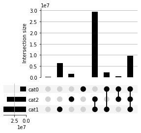
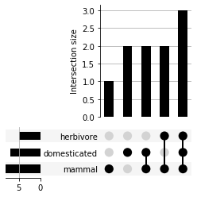
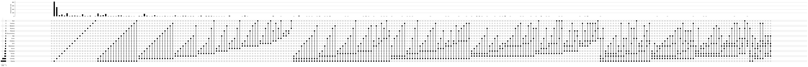

Data Format Guide
=================

Basic data format
-----------------

UpSetPlot can take a Pandas Series or DataFrame object with Multi-index
as input. Each ``Set`` is a level in
```pandas.MultiIndex`` <https://pandas.pydata.org/pandas-docs/stable/user_guide/advanced.html>`__
with boolean values.

Use ``Series`` as input
~~~~~~~~~~~~~~~~~~~~~~~

Below is a minimal example using ``Series`` as input:
.. code:: ipython3

    from upsetplot import generate_counts
    example_counts = generate_counts()
    example_counts


.. parsed-literal::

    cat0   cat1   cat2 
    False  False  False      56
                  True      283
           True   False    1279
                  True     5882
    True   False  False      24
                  True       90
           True   False     429
                  True     1957
    Name: value, dtype: int64


This is a
```pandas.Series`` <https://pandas.pydata.org/pandas-docs/stable/reference/api/pandas.Series.html>`__
with 3-level Multi-index. Each level is a ``Set``: ``cat0``, ``cat1``,
and ``cat2``. Each row is a unique subset with boolean values in indices
indicating memberships of each row. The value in each row indicates the
number of observations in each subset. ``upsetplot`` will simply plot
these numbers when supplied with a ``Series``:
.. code:: ipython3

    from upsetplot import UpSet
    UpSet(example_counts).plot()

.. parsed-literal::

    3 8 2


.. parsed-literal::

    {'matrix': <matplotlib.axes._subplots.AxesSubplot at 0x15270e10a290>,
     'shading': <matplotlib.axes._subplots.AxesSubplot at 0x15270e081e10>,
     'totals': <matplotlib.axes._subplots.AxesSubplot at 0x15270d7d9d10>,
     'intersections': <matplotlib.axes._subplots.AxesSubplot at 0x15270d7d9710>}


.. image:: DataFormatGuide_files/DataFormatGuide_7_2.png


Alternatively, we can supply a ``Series`` with each observation in a
row:
.. code:: ipython3

    from upsetplot import generate_samples
    example_samples = generate_samples().value
    example_samples


.. parsed-literal::

    cat0   cat1   cat2
    False  True   True    1.652317
                  True    1.510447
           False  True    1.584646
                  True    1.279395
           True   True    2.338243
                            ...   
                  True    1.701618
                  True    1.577837
    True   True   True    1.757554
    False  True   True    1.407799
    True   True   True    1.709067
    Name: value, Length: 10000, dtype: float64


In this case, we can use ``subset_size='count'`` to have ``upsetplot``
count the number of observations in each unique subset and plot them:
.. code:: ipython3

    from upsetplot import UpSet
    UpSet(example_samples, subset_size = 'count').plot()

.. parsed-literal::

    3 8 2


.. parsed-literal::

    {'matrix': <matplotlib.axes._subplots.AxesSubplot at 0x15270d6738d0>,
     'shading': <matplotlib.axes._subplots.AxesSubplot at 0x15270d660dd0>,
     'totals': <matplotlib.axes._subplots.AxesSubplot at 0x15270d631b90>,
     'intersections': <matplotlib.axes._subplots.AxesSubplot at 0x15270d616c50>}


.. image:: DataFormatGuide_files/DataFormatGuide_11_2.png


Use ``DataFrame`` as input:
~~~~~~~~~~~~~~~~~~~~~~~~~~~

A ``DataFrame`` can also be used as input to carry additional
information.
.. code:: ipython3

    from upsetplot import generate_samples
    example_samples_df = generate_samples()
    example_samples_df.head()


.. raw:: html

    <div>
    <style scoped>
        .dataframe tbody tr th:only-of-type {
            vertical-align: middle;
        }
    
        .dataframe tbody tr th {
            vertical-align: top;
        }
    
        .dataframe thead th {
            text-align: right;
        }
    </style>
    <table border="1" class="dataframe">
      <thead>
        <tr style="text-align: right;">
          <th></th>
          <th></th>
          <th></th>
          <th>index</th>
          <th>value</th>
        </tr>
        <tr>
          <th>cat0</th>
          <th>cat1</th>
          <th>cat2</th>
          <th></th>
          <th></th>
        </tr>
      </thead>
      <tbody>
        <tr>
          <th rowspan="5" valign="top">False</th>
          <th rowspan="2" valign="top">True</th>
          <th>True</th>
          <td>0</td>
          <td>1.652317</td>
        </tr>
        <tr>
          <th>True</th>
          <td>1</td>
          <td>1.510447</td>
        </tr>
        <tr>
          <th rowspan="2" valign="top">False</th>
          <th>True</th>
          <td>2</td>
          <td>1.584646</td>
        </tr>
        <tr>
          <th>True</th>
          <td>3</td>
          <td>1.279395</td>
        </tr>
        <tr>
          <th>True</th>
          <th>True</th>
          <td>4</td>
          <td>2.338243</td>
        </tr>
      </tbody>
    </table>
    </div>


In this data frame, each observation has two variables: ``index`` and
``value``. If we simply want to count the number of observations in each
unique subset, we can use ``subset_size='count'``:
.. code:: ipython3

    from upsetplot import UpSet
    UpSet(example_samples_df, subset_size = 'count').plot()

.. parsed-literal::

    3 8 2


.. parsed-literal::

    {'matrix': <matplotlib.axes._subplots.AxesSubplot at 0x15270d4d8f50>,
     'shading': <matplotlib.axes._subplots.AxesSubplot at 0x15270d508950>,
     'totals': <matplotlib.axes._subplots.AxesSubplot at 0x15270d451650>,
     'intersections': <matplotlib.axes._subplots.AxesSubplot at 0x15270d471cd0>}


.. image:: DataFormatGuide_files/DataFormatGuide_16_2.png


If for some reason, we want to plot the sum of a variable in each subset
(eg. ``index``), we can use ``sum_over='index'``. This will make
``upsetplot`` to take sum of a given variable in each unique subset and
plot that number:
.. code:: ipython3

    from upsetplot import UpSet
    plt = UpSet(example_samples_df, sum_over='index', subset_size='sum').plot()

.. parsed-literal::

    3 8 2





Convert Data to UpSet-compatible format
---------------------------------------

We can convert data from common formats to be compatible with
``upsetplot``.

Suppose we have three sets:
.. code:: ipython3

    mammals = ['Cat', 'Dog', 'Horse', 'Sheep', 'Pig', 'Cattle', 'Rhinoceros', 'Moose']
    herbivores = ['Horse', 'Sheep', 'Cattle', 'Moose', 'Rhinoceros']
    domesticated = ['Dog', 'Chicken', 'Horse', 'Sheep', 'Pig', 'Cattle', 'Duck']
    (mammals, herbivores, domesticated)


.. parsed-literal::

    (['Cat', 'Dog', 'Horse', 'Sheep', 'Pig', 'Cattle', 'Rhinoceros', 'Moose'],
     ['Horse', 'Sheep', 'Cattle', 'Moose', 'Rhinoceros'],
     ['Dog', 'Chicken', 'Horse', 'Sheep', 'Pig', 'Cattle', 'Duck'])


We can construct a data frame ready for plotting:
.. code:: ipython3

    import pandas as pd
    
    # make a data frame for each set
    mammal_df = pd.DataFrame({'mammal': True, 'Name': mammals})
    herbivore_df = pd.DataFrame({'herbivore': True, 'Name': herbivores})
    domesticated_df = pd.DataFrame({'domesticated': True, 'Name': domesticated})
    
    # Merge three data frames together
    animals_df = mammal_df.merge(
        herbivore_df.merge(domesticated_df, on = 'Name', how = 'outer'), 
        on = 'Name', how = 'outer')
    
    # Replace NaN with False
    animals_df = animals_df.fillna(False)
    
    # Make sets index for the data frame
    animals_df = animals_df.set_index(['mammal', 'herbivore', 'domesticated'])
    
    animals_df


.. raw:: html

    <div>
    <style scoped>
        .dataframe tbody tr th:only-of-type {
            vertical-align: middle;
        }
    
        .dataframe tbody tr th {
            vertical-align: top;
        }
    
        .dataframe thead th {
            text-align: right;
        }
    </style>
    <table border="1" class="dataframe">
      <thead>
        <tr style="text-align: right;">
          <th></th>
          <th></th>
          <th></th>
          <th>Name</th>
        </tr>
        <tr>
          <th>mammal</th>
          <th>herbivore</th>
          <th>domesticated</th>
          <th></th>
        </tr>
      </thead>
      <tbody>
        <tr>
          <th rowspan="8" valign="top">True</th>
          <th rowspan="2" valign="top">False</th>
          <th>False</th>
          <td>Cat</td>
        </tr>
        <tr>
          <th>True</th>
          <td>Dog</td>
        </tr>
        <tr>
          <th rowspan="2" valign="top">True</th>
          <th>True</th>
          <td>Horse</td>
        </tr>
        <tr>
          <th>True</th>
          <td>Sheep</td>
        </tr>
        <tr>
          <th>False</th>
          <th>True</th>
          <td>Pig</td>
        </tr>
        <tr>
          <th rowspan="3" valign="top">True</th>
          <th>True</th>
          <td>Cattle</td>
        </tr>
        <tr>
          <th>False</th>
          <td>Rhinoceros</td>
        </tr>
        <tr>
          <th>False</th>
          <td>Moose</td>
        </tr>
        <tr>
          <th rowspan="2" valign="top">False</th>
          <th rowspan="2" valign="top">False</th>
          <th>True</th>
          <td>Chicken</td>
        </tr>
        <tr>
          <th>True</th>
          <td>Duck</td>
        </tr>
      </tbody>
    </table>
    </div>


Now we can plot:
.. code:: ipython3

    from upsetplot import UpSet
    plt = UpSet(animals_df, subset_size='count').plot()

.. parsed-literal::

    3 5 2





| ``upsetplot`` actually provides a function ``from_contents`` to do
  this for you.
| ``from_contents`` takes a
  `dictionary <https://docs.python.org/3/tutorial/datastructures.html#dictionaries>`__
  as input. The input dictionary should have set names as key and a
  `list <https://docs.python.org/3/tutorial/datastructures.html>`__ of
  set members as values:
.. code:: ipython3

    from upsetplot import from_contents
    animals_df = from_contents({'mammal': mammals, 'herbivore': herbivores, 'domesticated': domesticated})
    animals_df


.. raw:: html

    <div>
    <style scoped>
        .dataframe tbody tr th:only-of-type {
            vertical-align: middle;
        }
    
        .dataframe tbody tr th {
            vertical-align: top;
        }
    
        .dataframe thead th {
            text-align: right;
        }
    </style>
    <table border="1" class="dataframe">
      <thead>
        <tr style="text-align: right;">
          <th></th>
          <th></th>
          <th></th>
          <th>id</th>
        </tr>
        <tr>
          <th>mammal</th>
          <th>herbivore</th>
          <th>domesticated</th>
          <th></th>
        </tr>
      </thead>
      <tbody>
        <tr>
          <th rowspan="8" valign="top">True</th>
          <th rowspan="2" valign="top">False</th>
          <th>False</th>
          <td>Cat</td>
        </tr>
        <tr>
          <th>True</th>
          <td>Dog</td>
        </tr>
        <tr>
          <th rowspan="2" valign="top">True</th>
          <th>True</th>
          <td>Horse</td>
        </tr>
        <tr>
          <th>True</th>
          <td>Sheep</td>
        </tr>
        <tr>
          <th>False</th>
          <th>True</th>
          <td>Pig</td>
        </tr>
        <tr>
          <th rowspan="3" valign="top">True</th>
          <th>True</th>
          <td>Cattle</td>
        </tr>
        <tr>
          <th>False</th>
          <td>Rhinoceros</td>
        </tr>
        <tr>
          <th>False</th>
          <td>Moose</td>
        </tr>
        <tr>
          <th rowspan="2" valign="top">False</th>
          <th rowspan="2" valign="top">False</th>
          <th>True</th>
          <td>Chicken</td>
        </tr>
        <tr>
          <th>True</th>
          <td>Duck</td>
        </tr>
      </tbody>
    </table>
    </div>


Converting any Data Frame to “Subset-ready” format
--------------------------------------------------

Let’s take a look at the ``movies`` dataset used in the `original
publication by Alexander Lex et
al. <https://caleydo.org/publications/2014_infovis_upset/>`__ and
`UpSetR package <https://github.com/hms-dbmi/UpSetR>`__.
.. code:: ipython3

    movies = pd.read_csv("../movies.csv")
    movies.head()


.. raw:: html

    <div>
    <style scoped>
        .dataframe tbody tr th:only-of-type {
            vertical-align: middle;
        }
    
        .dataframe tbody tr th {
            vertical-align: top;
        }
    
        .dataframe thead th {
            text-align: right;
        }
    </style>
    <table border="1" class="dataframe">
      <thead>
        <tr style="text-align: right;">
          <th></th>
          <th>Name</th>
          <th>ReleaseDate</th>
          <th>Action</th>
          <th>Adventure</th>
          <th>Children</th>
          <th>Comedy</th>
          <th>Crime</th>
          <th>Documentary</th>
          <th>Drama</th>
          <th>Fantasy</th>
          <th>...</th>
          <th>Horror</th>
          <th>Musical</th>
          <th>Mystery</th>
          <th>Romance</th>
          <th>SciFi</th>
          <th>Thriller</th>
          <th>War</th>
          <th>Western</th>
          <th>AvgRating</th>
          <th>Watches</th>
        </tr>
      </thead>
      <tbody>
        <tr>
          <th>0</th>
          <td>Toy Story (1995)</td>
          <td>1995</td>
          <td>0</td>
          <td>0</td>
          <td>1</td>
          <td>1</td>
          <td>0</td>
          <td>0</td>
          <td>0</td>
          <td>0</td>
          <td>...</td>
          <td>0</td>
          <td>0</td>
          <td>0</td>
          <td>0</td>
          <td>0</td>
          <td>0</td>
          <td>0</td>
          <td>0</td>
          <td>4.15</td>
          <td>2077</td>
        </tr>
        <tr>
          <th>1</th>
          <td>Jumanji (1995)</td>
          <td>1995</td>
          <td>0</td>
          <td>1</td>
          <td>1</td>
          <td>0</td>
          <td>0</td>
          <td>0</td>
          <td>0</td>
          <td>1</td>
          <td>...</td>
          <td>0</td>
          <td>0</td>
          <td>0</td>
          <td>0</td>
          <td>0</td>
          <td>0</td>
          <td>0</td>
          <td>0</td>
          <td>3.20</td>
          <td>701</td>
        </tr>
        <tr>
          <th>2</th>
          <td>Grumpier Old Men (1995)</td>
          <td>1995</td>
          <td>0</td>
          <td>0</td>
          <td>0</td>
          <td>1</td>
          <td>0</td>
          <td>0</td>
          <td>0</td>
          <td>0</td>
          <td>...</td>
          <td>0</td>
          <td>0</td>
          <td>0</td>
          <td>1</td>
          <td>0</td>
          <td>0</td>
          <td>0</td>
          <td>0</td>
          <td>3.02</td>
          <td>478</td>
        </tr>
        <tr>
          <th>3</th>
          <td>Waiting to Exhale (1995)</td>
          <td>1995</td>
          <td>0</td>
          <td>0</td>
          <td>0</td>
          <td>1</td>
          <td>0</td>
          <td>0</td>
          <td>1</td>
          <td>0</td>
          <td>...</td>
          <td>0</td>
          <td>0</td>
          <td>0</td>
          <td>0</td>
          <td>0</td>
          <td>0</td>
          <td>0</td>
          <td>0</td>
          <td>2.73</td>
          <td>170</td>
        </tr>
        <tr>
          <th>4</th>
          <td>Father of the Bride Part II (1995)</td>
          <td>1995</td>
          <td>0</td>
          <td>0</td>
          <td>0</td>
          <td>1</td>
          <td>0</td>
          <td>0</td>
          <td>0</td>
          <td>0</td>
          <td>...</td>
          <td>0</td>
          <td>0</td>
          <td>0</td>
          <td>0</td>
          <td>0</td>
          <td>0</td>
          <td>0</td>
          <td>0</td>
          <td>3.01</td>
          <td>296</td>
        </tr>
      </tbody>
    </table>
    <p>5 rows × 21 columns</p>
    </div>


In this table, each movie occupies a row with each column being a
feature of the film. columns 3 to 19 records the genre each film belong
in, with ``1`` indicating that the movie belongs to this genre.

Since ``upsetplot`` requires its set data be boolean values, we convert
the numberical coding in this dataset to boolean values and set them as
index:
.. code:: ipython3

    genres = list(movies.columns[2:len(movies.columns)-2])
    movies_genre = movies[genres].astype(bool)
    movies_genre = pd.concat([movies_genre, movies[[i for i in list(movies.columns) if i not in genres]]], axis=1).set_index(genres)
    movies_genre.head()


.. raw:: html

    <div>
    <style scoped>
        .dataframe tbody tr th:only-of-type {
            vertical-align: middle;
        }
    
        .dataframe tbody tr th {
            vertical-align: top;
        }
    
        .dataframe thead th {
            text-align: right;
        }
    </style>
    <table border="1" class="dataframe">
      <thead>
        <tr style="text-align: right;">
          <th></th>
          <th></th>
          <th></th>
          <th></th>
          <th></th>
          <th></th>
          <th></th>
          <th></th>
          <th></th>
          <th></th>
          <th></th>
          <th></th>
          <th></th>
          <th></th>
          <th></th>
          <th></th>
          <th></th>
          <th>Name</th>
          <th>ReleaseDate</th>
          <th>AvgRating</th>
          <th>Watches</th>
        </tr>
        <tr>
          <th>Action</th>
          <th>Adventure</th>
          <th>Children</th>
          <th>Comedy</th>
          <th>Crime</th>
          <th>Documentary</th>
          <th>Drama</th>
          <th>Fantasy</th>
          <th>Noir</th>
          <th>Horror</th>
          <th>Musical</th>
          <th>Mystery</th>
          <th>Romance</th>
          <th>SciFi</th>
          <th>Thriller</th>
          <th>War</th>
          <th>Western</th>
          <th></th>
          <th></th>
          <th></th>
          <th></th>
        </tr>
      </thead>
      <tbody>
        <tr>
          <th rowspan="5" valign="top">False</th>
          <th>False</th>
          <th>True</th>
          <th>True</th>
          <th>False</th>
          <th>False</th>
          <th>False</th>
          <th>False</th>
          <th>False</th>
          <th>False</th>
          <th>False</th>
          <th>False</th>
          <th>False</th>
          <th>False</th>
          <th>False</th>
          <th>False</th>
          <th>False</th>
          <td>Toy Story (1995)</td>
          <td>1995</td>
          <td>4.15</td>
          <td>2077</td>
        </tr>
        <tr>
          <th>True</th>
          <th>True</th>
          <th>False</th>
          <th>False</th>
          <th>False</th>
          <th>False</th>
          <th>True</th>
          <th>False</th>
          <th>False</th>
          <th>False</th>
          <th>False</th>
          <th>False</th>
          <th>False</th>
          <th>False</th>
          <th>False</th>
          <th>False</th>
          <td>Jumanji (1995)</td>
          <td>1995</td>
          <td>3.20</td>
          <td>701</td>
        </tr>
        <tr>
          <th rowspan="3" valign="top">False</th>
          <th rowspan="3" valign="top">False</th>
          <th rowspan="3" valign="top">True</th>
          <th rowspan="3" valign="top">False</th>
          <th rowspan="3" valign="top">False</th>
          <th>False</th>
          <th>False</th>
          <th>False</th>
          <th>False</th>
          <th>False</th>
          <th>False</th>
          <th>True</th>
          <th>False</th>
          <th>False</th>
          <th>False</th>
          <th>False</th>
          <td>Grumpier Old Men (1995)</td>
          <td>1995</td>
          <td>3.02</td>
          <td>478</td>
        </tr>
        <tr>
          <th>True</th>
          <th>False</th>
          <th>False</th>
          <th>False</th>
          <th>False</th>
          <th>False</th>
          <th>False</th>
          <th>False</th>
          <th>False</th>
          <th>False</th>
          <th>False</th>
          <td>Waiting to Exhale (1995)</td>
          <td>1995</td>
          <td>2.73</td>
          <td>170</td>
        </tr>
        <tr>
          <th>False</th>
          <th>False</th>
          <th>False</th>
          <th>False</th>
          <th>False</th>
          <th>False</th>
          <th>False</th>
          <th>False</th>
          <th>False</th>
          <th>False</th>
          <th>False</th>
          <td>Father of the Bride Part II (1995)</td>
          <td>1995</td>
          <td>3.01</td>
          <td>296</td>
        </tr>
      </tbody>
    </table>
    </div>


Now let’s plot!
.. code:: ipython3

    import upsetplot as upset
    upset.UpSet(movies_genre, subset_size='count').plot()

.. parsed-literal::

    17 280 2


.. parsed-literal::

    {'matrix': <matplotlib.axes._subplots.AxesSubplot at 0x15270d015310>,
     'shading': <matplotlib.axes._subplots.AxesSubplot at 0x15270d07b890>,
     'totals': <matplotlib.axes._subplots.AxesSubplot at 0x15270cfb0d90>,
     'intersections': <matplotlib.axes._subplots.AxesSubplot at 0x15270cf11110>}





Above plot gives every single subset based on the input data. Since we
have a 17-level multi-index, we are seeing :math:`2^{17}=131072`
possible subsets (although in this dataset we have only 280 total
subsets). In cases like this, it can be helpful to set an observation
threshold to exclude low-count subsets. This can be achieved by grouping
data mannually and filter by counts:
.. code:: ipython3

    movies_genre_grouped = movies_genre.groupby(level=genres).count()
    movies_genre_subset = movies_genre_grouped[movies_genre_grouped.Name>40]
    upset.UpSet(movies_genre_subset.Name).plot()

.. parsed-literal::

    17 14 2


.. parsed-literal::

    {'matrix': <matplotlib.axes._subplots.AxesSubplot at 0x15270d2a09d0>,
     'shading': <matplotlib.axes._subplots.AxesSubplot at 0x15270d28ca90>,
     'totals': <matplotlib.axes._subplots.AxesSubplot at 0x15270d26c250>,
     'intersections': <matplotlib.axes._subplots.AxesSubplot at 0x15270cfefed0>}


.. image:: DataFormatGuide_files/DataFormatGuide_36_2.png

